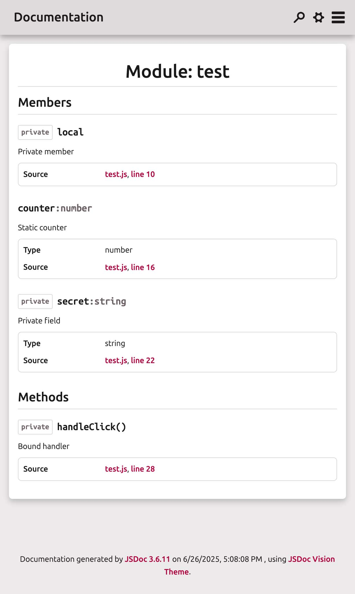
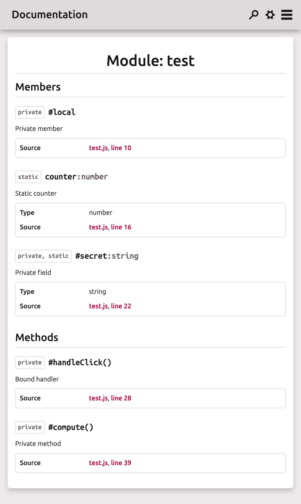

# JSDoc ESNext Plugin

**Smart JSDoc plugin that adds full ES2022+ class-feature support – private fields, static members and arrow-bound methods.**

Modern JavaScript syntax isn’t always accurately recognized by JSDoc. This plugin enables accurate recognition of modern ECMAScript class structures and enhances the resulting documentation.

## Features

* Restores accurate naming for native `#privateFields` and `#methods()`.
* Automatically tags private members with `@private`.
* Detects `static` class members and applies `@static` and `scope: static`.
* Treats arrow-bound methods as `@function`.
* Detects assignments like `this.#foo = ...` in constructors.
* Works seamlessly with JSDoc's default parser.
* Works with all themes (but see note below!).
* Perfectly integrates with [VisionTheme](https://github.com/alphanull/jsdoc-vision-theme) for a modern UI (optional).
* Tested with JSDoc 3.6.11 and 4.0.4.

## Installation

```bash
npm install --save-dev @alphanull/jsdoc-plugin-esnext
```

Then, add the plugin to your JSDoc configuration file:

```json
{
    "plugins": [
        "@alphanull/jsdoc-plugin-esnext"
    ]
}
```

## Example

```js
export default class Example {

    /**
     * Static counter
     * @type {number}
     */
    static counter = 0;

    /**
     * Private field
     * @type {string}
     */
    static #secret = 'abc';

    /**
     * Bound handler
     * @function
     */
    #handleClick = () => {
        console.log('clicked');
    }

    constructor() {
        this.#local = 123;
    }

    /**
     * Private method
     */
    #compute() {
        return true;
    }
}
```

### Resulting Documentation:

|  |  |
| :----------------------------------------------------------: | :----------------------------------------------------------: |
|                      **Without plugin**                      |                **Using jsdoc-plugin-esnext**                 |

* `counter` appears with `@static` and type.
* `#secret` is listed as `private static`.
* `#handleClick` is listed as a private function.
* `#compute()` is listed as a private method.

## Limitations

While there are no limitations with this plugin per se, for private members (which start with "#")  there can be resulting hash links containing two hashes, like: `<a href="##privateMember">#privateMember</a>` which can lead to broken links. Unfortunately, this cannot be handled by the plugin itself and needs to be managed by the theme.

The good news is that documenting modern code typically requires a modern theme anyway. Consider using the brand-new [JSDoc VisionTheme](https://github.com/alphanull/jsdoc-vision-theme), which addresses this issue and is fully tested and optimized for compatibility with this plugin.

## License

[MIT License](https://opensource.org/license/MIT)

Copyright © 2025–present Frank Kudermann @ [alphanull.de](https://alphanull.de)